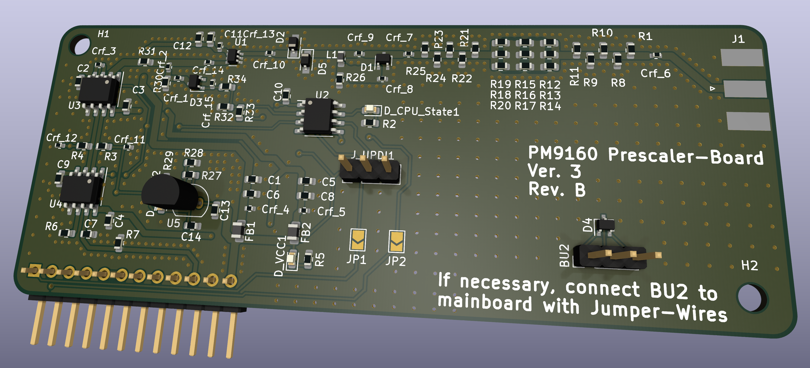

# PM9610_Mk3_PrescalerBoard

This is a fork of SaabFANs original "PM9160_Mk3_PrescalerBoard"-Project. I fixed some minor KiCad-Related Layout issues, cleaned up the schematic a little bit to improve readability and made the Board compatible with Aislers "Beautiful Boards Budget Simple" PCB manufacturing service.

This is a recreation of the PM9160 Prescaler-Board, used in the PM6654x Programmable Counters made by Philips back in the late 80s / early 90s. 
It divides incoming frequencies by 16. With this, a 2.4 Ghz Signal can be counted by the "Counter on a Chip"-Hardware inside the Counter, to which the signal is routed internally on the Mainboard. 

The board uses modern ICs to recreate the original function of the board, which makes it possible to put everything inside the 10x10cm Limit for a cheap 2 Layer Board from most board manufacturers. 
An AtTiny1616 Processor replaces the original analog circuit for the detection of an RF Signal Present and for the handling of Signals !B and TEST_GO. For better Accessibility during testing, the component side has been changed from the original Board. 
Software for the AtTiny1616 is written in C with the PlatformIO-IDE. 

Note: It might be necessary to use longer Pin Headers for the connectors. Make sure, the pins are not too long though, as they can touch the case and short out the 5V and -8.5V Rails!
